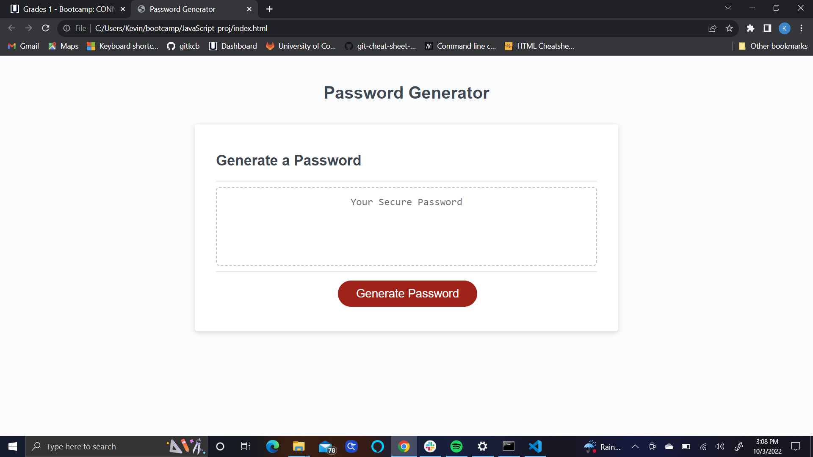
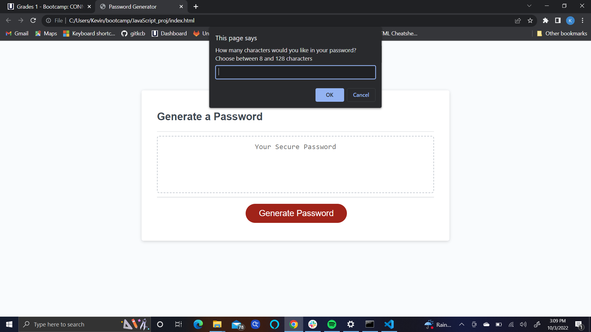
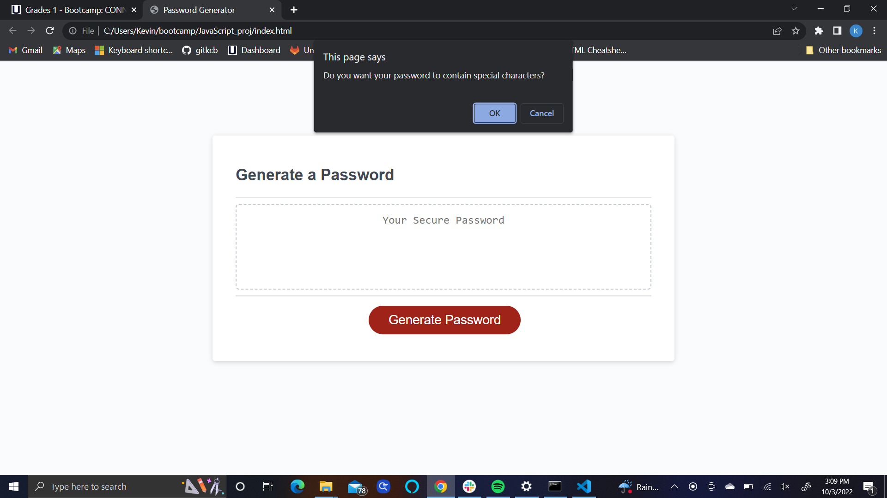
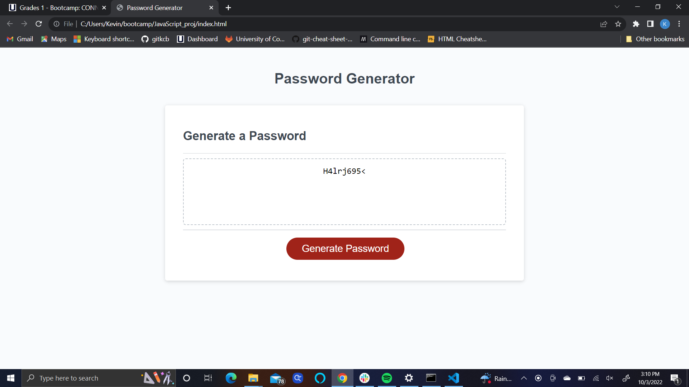

# JavaScript_proj
Link to deployed page:
https://gitkcb.github.io/password_gen/
## Description
The motivation for this project was to create random passwords for users. I built this project to create a randomized password that takes user-determined information on password length, as well as, the characters included in the password (lowercase alphabet, uppercase alphabet, numbers, and special characters.) This program gives users a secure password that can contain 8-128 characters. I learned about variables, arrays, and loops while working on the project. 

## Usage
The user clicks the "generate password" button then chooses how to many characters they want to use in their password. After they choose the password length they choose if they want lowercase letters, uppercase letters, numbers, and special characters included in their randomized password. 

 
## Credits
Starter code obtained from: https://github.com/coding-boot-camp/friendly-parakeet
referenced repository for assistance: https://github.com/TiffanyCasey/Password-Generator/blob/master/script.js

